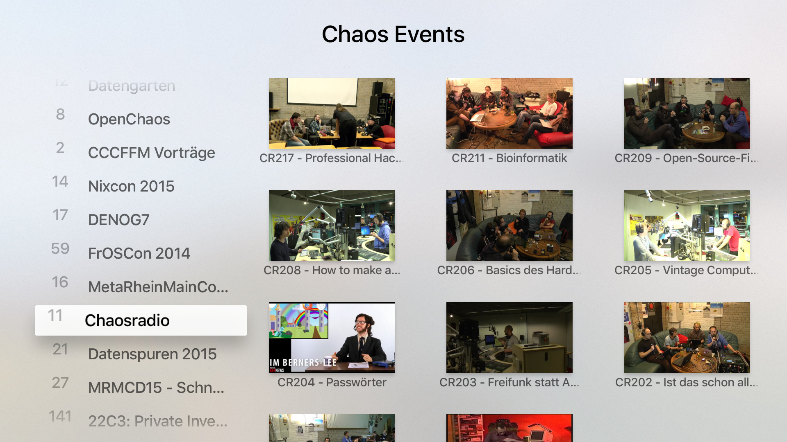

# CCC-TV #

A Fronted to the content from media.ccc.de for new the Apple Tv.

## About ##

### English ###

The Chaos Computer Club is besides being Europes largest Hacker Association a great fusion for manifoldly interested people all over the world.
They mostly meet up in small get–togethers but meet as well on huge conferences. They talk to each other, they teach each other and they do everything to keep information flowing.
 
For many years the Chaos Computer Club creates Video-Content documentating a large number of talks and activities. Of course this content is accessible in several ways.
CCC-TV is your App to watch Video-Content of the Chaos Computer Club in a convenient way at home on your Apple TV.
This easy to use App reduces the barrier and makes the activities of the Chaos Computer Club obvious for a wider audience.
 
Just select the event your interested in and enjoy the various world of Chaos Computer Club on your sofa!

### German
Der Chaos Computer Club ist Europa größte Hackervereinigung und ein Treffpunkt für vielfältig interessierte Menschen aus der ganzen Welt.
Man trifft sich vor Allem in kleinen Zusammenkünften, aber auch auf großen Konferenzen. Es wird gebastelt, ausprobiert und getüftelt. Technische Schranken werden beseitigt, Neues gebaut und Altes zerlegt.
Es wird diskutiert und politisiert. Bei allen Aktivitäten stehen jedoch Kommunikation und Austausch im Vordergrund.

Seit vielen Jahren kreiert der Chaos Computer Club Videos, die viele der Vorträge und Aktivitäten dokumentieren. Natürlich sind diese Videos auch über verschiedene Wege abrufbar.
Mit der App CCC-TV ist der Video-Content des Chaos Computer Club nun auf bequeme Art und Weise auf dem Apple TV verfügbar.
Diese einfach zu bedienende App reduziert die Hürde zum Chaos Computer Club und macht die Aktivitäten de Clubs einer breiteren Öffentlichkeit verfügbar.
 
Einfach auf´s Sofa setzen, CCC-TV auswählen und in die wunderbar vielfältige Welt des Chaos Computer Club eintauchen!

## Contributors ##

* Kris Simon (adt, ccc-ffm)

If you like to contribute, please read this [document](./resources/contribute.md).