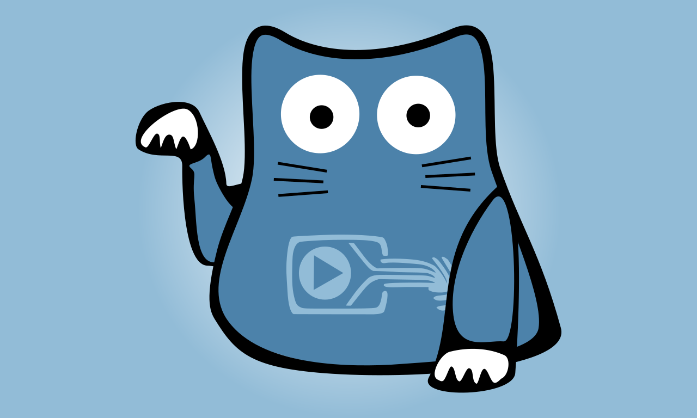

# CCC-TV #

A Frontend to the content from media.ccc.de for the new Apple TV.

## About ##

### English ###
The Chaos Computer Club is Europe's largest hacker community and allows people with a wide range of interests from all over the world to meet up and discuss various topics. The club generally meets in small groups/get-togethers, but also hosts large conferences. Here they tinker, talk and exchange ideas. Technical barriers are overcome, new things created and old ones taken apart. Discussions range from technological to political and social topics, with a focus on communication and exchange of ideas and information.

For over fifteen years, the Chaos Computer Club has created videos to document the many talks and activities, many of which are available via various platforms. The CCC-TV now allows users to comfortably access this video material via their Apple TV and provides an insight into the club's activities.

Just relax on your couch, select the CCC-TV app and immerse yourself in the wonderful world of the Chaos Computer Club.

### German
Der Chaos Computer Club ist Europas größte Hackervereinigung und ein Treffpunkt für vielfältig interessierte Menschen aus der ganzen Welt.
Man trifft sich vor Allem in kleinen Zusammenkünften, aber auch auf großen Konferenzen. Es wird gebastelt, ausprobiert und getüftelt. Technische Schranken werden beseitigt, Neues gebaut und Altes zerlegt.
Es wird diskutiert und politisiert. Bei allen Aktivitäten stehen jedoch Kommunikation und Austausch im Vordergrund.

Seit vielen Jahren kreiert der Chaos Computer Club Videos, die viele der Vorträge und Aktivitäten dokumentieren. Natürlich sind diese Videos auch über verschiedene Wege abrufbar.
Mit der App CCC-TV ist der Video-Content des Chaos Computer Club nun auf bequeme Art und Weise auf dem Apple TV verfügbar.
Diese einfach zu bedienende App reduziert die Hürde zum Chaos Computer Club und macht die Aktivitäten de Clubs einer breiteren Öffentlichkeit verfügbar.
 
Einfach auf´s Sofa setzen, CCC-TV auswählen und in die wunderbar vielfältige Welt des Chaos Computer Club eintauchen!

### Dutch
De "Chaos Computer Club" is Europaʼs grootste hacker gemeenschap en een
platform voor mensen uit de hele wereld met zeer gevarieerde interesses om zeer
uiteenlopende onderwerpen te bespreken. Zij ontmoeten elkaar in kleine groepen of
bijeenkomsten, maar ook op grote conferenties. Hier wordt geknutseld,
geëxperimenteerd en worden ideeën uitgewisseld. Technische barrières worden
geslecht, nieuwe gebieden ontgonnen en oude ideeën ontmanteld. Er wordt
gesproken en gedebatteerd over zowel technische als politieke en sociale
onderwerpen, waarbij communicatie en uitwisseling van ideeën en informatie altijd
centraal blijven staan.
Sinds vele jaren maakt de Chaos Computer Club videos, die de vele gesprekken en
activiteiten van de club vastleggen. Deze videoʼs zijn uiteraard voor iedereen
toegankelijk gemaakt via verschillende kanalen en platforms. Met de nieuwe CCC-TV
app is de video-inhoud van de Chaos Computer Club nu gemakkelijk op de Apple TV
te bekijken en worden de activiteiten van de club aan een breder publiek beschikbaar
gesteld.
Gewoon lekker gaan zitten, CCC-TV selecteren, en duik in de wonderbaarlijk diverse
wereld van de Chaos Computer Club!

### French
Le Chaos Computer Club est le plus grand rassemblement de hackers au
niveau européen. C'est un lieu de rencontre pour des gens venant de
partout dans le monde, ayant des intérêts multiples. Le plus souvent
ce sont des petits groupes qui se rencontrent, mais des grandes
conférences ont également lieu. Les gens bricolent, essaient,
bidouillent des nouvelles techniques. Des obstacles techniques sont
dépassés, on crée des nouvelles choses et déconstruit
d'anciennes. C'est un lieu de discussions politiques, mais l'échange
et la communication priment sur tout.

Depuis beaucoup d'années, le CCC crée des vidéos qui documentent ces
présentations et activités. Naturellement on a accès à ces vidéos de
plusieurs façons. Avec l'application CCC-TV, le contenu vidéo est
disponible de façon confortable sur Apple TV. L'application est facile
à manipuler et facilite ainsi l'accès au club pour le grand publique.

Asseyez-vous donc simplement sur votre canapé, sélectionnez CCC-TV et
plongez dans le monde si merveilleusement diversifié du Chaos Computer
Club!

### Greek 
Το Chaos Computer Club είναι η μεγαλύτερη ένωση χάκερ της Ευρώπης και ένα σημείο 
συνάντησης ανθρώπων με ποικίλα ενδιαφέροντα από ολόκληρο τον κόσμο. Συναντιόμαστε κυρίως 
στο πλαίσιο μικρών συνελεύσεων, αλλά και σε μεγάλα συνέδρια. Εκεί συζητάμε, σχεδιάζουμε 
και ανταλλάσσουμε ιδέες. Τα τεχνικά εμπόδια εξαλείφονται, δημιουργούμε νέα τεχνολογία και 
αναλύουμε την παλιά. Μέρος των συζητήσεών μας αποτελεί και η πολιτική. Επίκεντρο όλων των 
δραστηριοτήτων είναι η επικοινωνία και η ανταλλαγή.

Εδώ και πολλά χρόνια το Chaos Computer Club δημιουργεί βίντεο στα οποία τεκμηριώνονται 
πολλές από τις παρουσιάσεις και τις δραστηριότητές μας. Τα βίντεο αυτά είναι διαθέσιμα με 
διάφορους τρόπους, αλλά μέσω της εφαρμογής CCC-TV μπορείτε τώρα να απολαμβάνετε άνετα τα 
περιεχόμενα βίντεο του Chaos Computer Club από την Apple TV. Αυτή η εύχρηστη εφαρμογή 
φέρνει το Chaos Computer Club πιο κοντά και πλέον έχουν πρόσβαση στις δραστηριότητές του 
ακόμη περισσότερα άτομα.

Καθίστε απλώς στον καναπέ σας, επιλέξτε την εφαρμογή CCC-TV και βυθιστείτε στον 
μοναδικά πολύπλευρο κόσμο του Chaos Computer Club!

## Contributors ##

* Kris Simon (adt, ccc-ffm)
* Wonko (ccc-ffm)
* Phoenoxol (ccc-ffm)

If you like to contribute, please read this [document](./resources/contribute.md).
